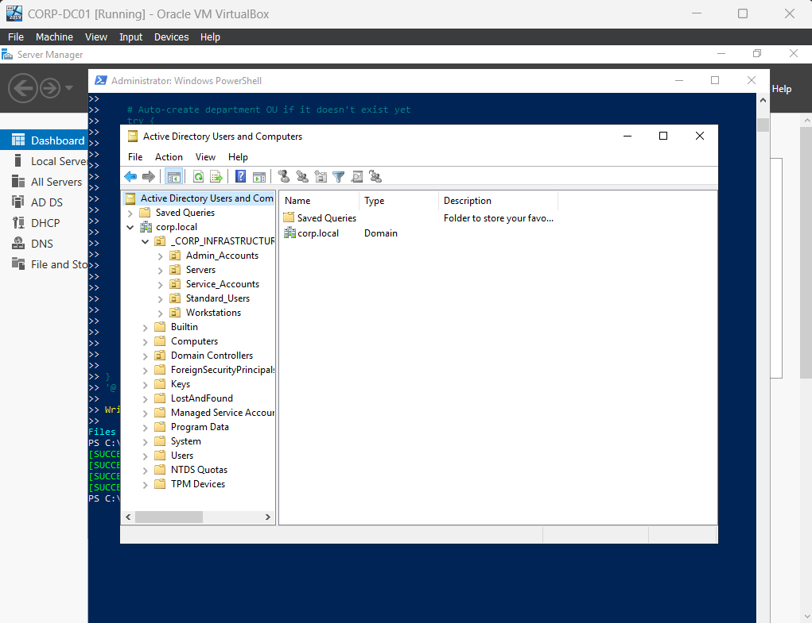
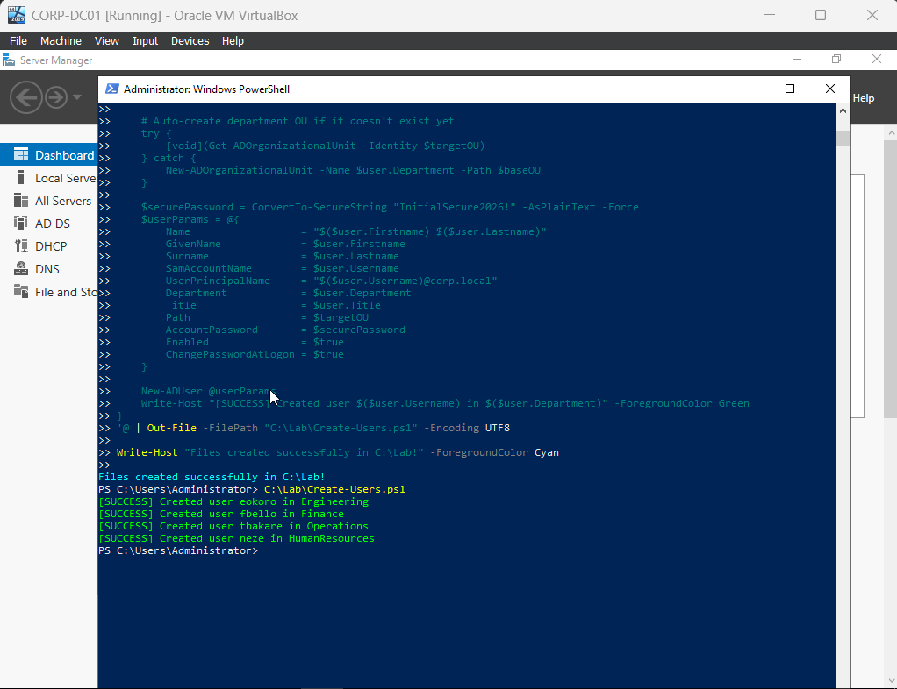
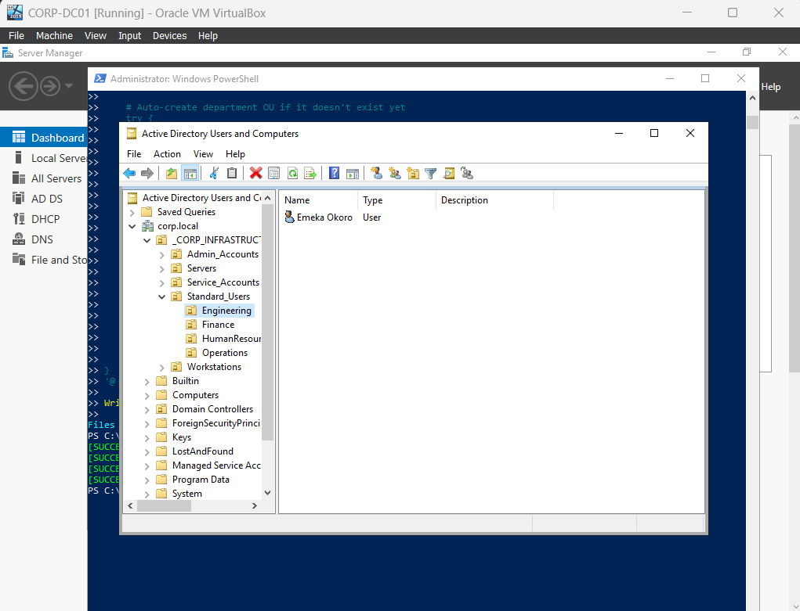
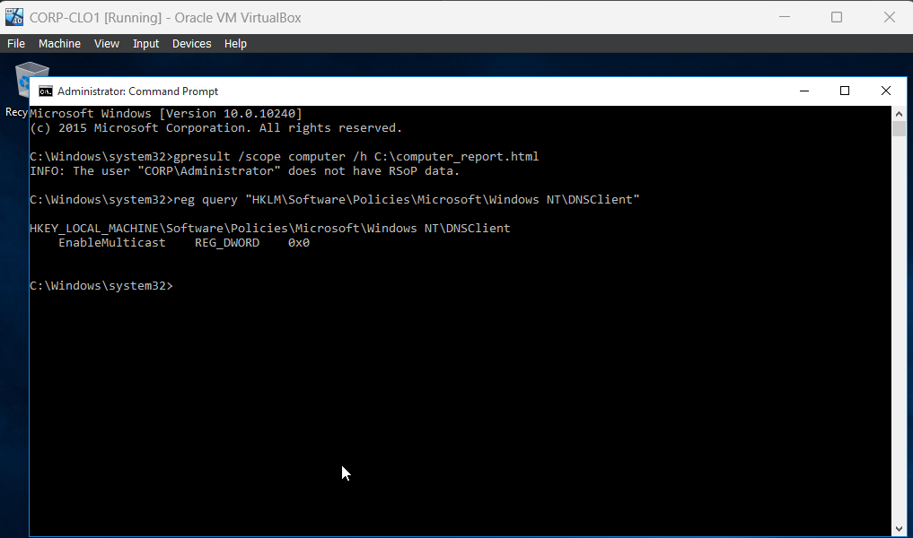
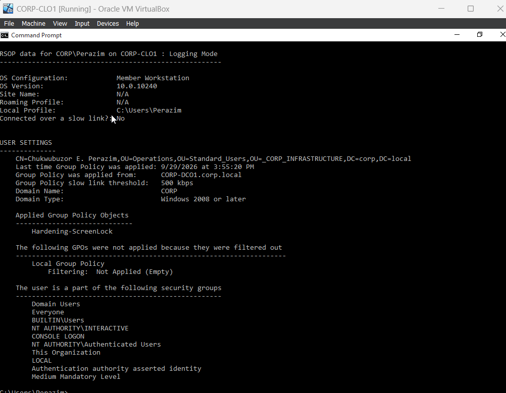
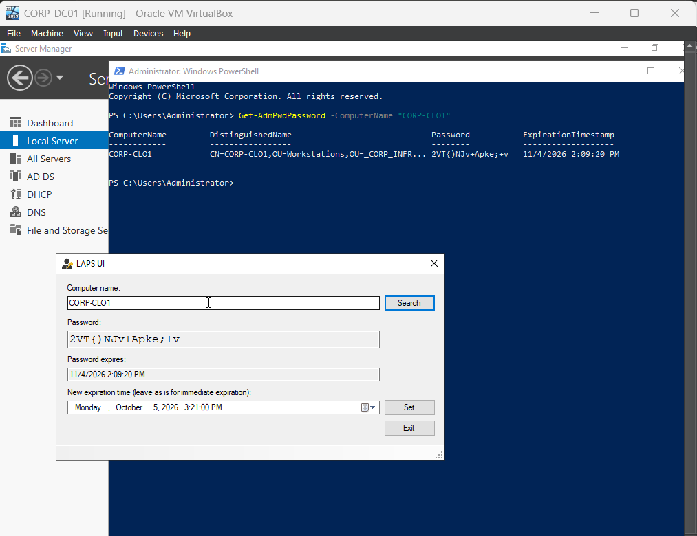
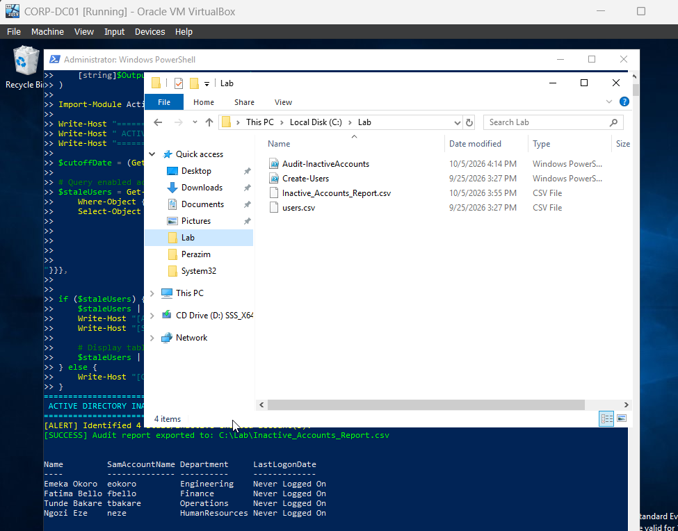

# Active Directory Enterprise Hardening, Microsoft LAPS & PowerShell Identity Lifecycle Automation

[](https://www.microsoft.com/evalcenter/evaluate-windows-server-2019)
[](https://www.microsoft.com/evalcenter/evaluate-windows-10-enterprise)
[](https://github.com/PowerShell/PowerShell)
[](https://learn.microsoft.com/windows-server/identity/laps/laps-overview)
[](https://www.cisecurity.org/)
[](https://github.com/ChukwubuzorPerazim)

---

## 1. Executive Summary & Problem Statement

Default, out-of-the-box Active Directory deployments introduce critical security vulnerabilities into enterprise environments:
1. **Flat Structural Hierarchy:** Default placement of all accounts and systems into generic containers (`CN=Users`, `CN=Computers`) prevents targeted Group Policy enforcement and violates administrative segregation of duties.
2. **Credential Theft via Multicast Poisoning:** Unrestricted legacy name resolution protocols (such as LLMNR and NetBIOS) broadcast authentication traffic across local subnets, allowing adversaries running tools like `Responder` to capture user NetNTLM hashes.
3. **Lateral Movement via Shared Local Admin Credentials:** Workstations sharing identical local administrator passwords allow adversaries to pivot across an entire subnet following a single endpoint compromise.
4. **Account Stagnation & Dormant Backdoors:** Unmonitored, inactive accounts introduce persistent access vectors that bypass standard security reviews.

This project implements an enterprise-grade defense-in-depth architecture on **Windows Server 2019** (`corp.local`). It deploys a **Tiered Organizational Unit (OU) model**, automates identity lifecycles via **PowerShell**, eliminates lateral movement using **Microsoft LAPS**, and enforces **CIS Benchmark Group Policy Objects (GPOs)** across domain controllers and workstations.

---

## 2. Enterprise Tiered Architecture & Identity Design

```
corp.local
├── _CORP_INFRASTRUCTURE (Top-Level Production OU)
│   ├── Admin_Accounts      (Tier 0 & Tier 1 Privileged Identities)
│   ├── Standard_Users      (Domain Employees Subject to User GPOs)
│   │   ├── Engineering     (User: Emeka Okoro)
│   │   ├── Finance         (User: Fatima Bello)
│   │   ├── Operations      (Users: Tunde Bakare, Chukwubuzor E. Perazim)
│   │   └── HumanResources  (User: Ngozi Eze)
│   ├── Workstations        (Endpoints Enforcing LAPS & LLMNR Disablement)
│   │   └── CORP-CLO1       (Windows 10 Workstation)
│   ├── Servers             (Member Servers & Tier 1 Infrastructure)
│   └── Service_Accounts    (Non-Interactive Service Principals)
└── Builtin / Default Containers (Default AD System Containers)
```

### Security Policy Enforcement Matrix

| Policy Object | Target OU | CIS Benchmark Control | Threat Mitigated |
| :--- | :--- | :--- | :--- |
| **`Hardening-Disable-LLMNR`** | `OU=Workstations` | CIS 18.4.4.1 | Man-in-the-Middle credential interception via Responder / NetNTLM hash poisoning. |
| **`LAPS-Policy`** | `OU=Workstations` | CIS 18.2.1 | Pass-the-Hash and lateral movement across domain workstations. |
| **`Hardening-ScreenLock`** | `OU=Standard_Users` | CIS 18.9.15.1 | Unauthorized physical workstation access via 10-minute inactivity timeout. |
| **`Default Domain Policy`** | Domain Root (`corp.local`) | CIS 1.1.1 - 1.2.3 | Password spraying and brute-force attacks (14-char min length, 5-attempt lockout). |

---

## 3. Implementation Walkthrough

### Phase 1: Tiered OU Provisioning & Asset Migration
1. Provisioned top-level protected container `_CORP_INFRASTRUCTURE` with accidental deletion flags enabled.
2. Structured departmental sub-OUs under `Standard_Users` (`Engineering`, `Finance`, `Operations`, `HumanResources`).
3. Migrated production workstation `CORP-CLO1` from the default `CN=Computers` container into `OU=Workstations,OU=_CORP_INFRASTRUCTURE,DC=corp,DC=local`.
4. Migrated domain user `Chukwubuzor E. Perazim` into the `Operations` OU.

### Phase 2: Automated Bulk User Provisioning via PowerShell
Engineered an automated onboarding pipeline (`Create-Users.ps1`) that parses standardized employee data (`users.csv`), dynamically validates target departmental OUs, and generates compliant Active Directory objects with randomized initial credentials and forced password updates on initial authentication:

```powershell
Import-Module ActiveDirectory
$csv = Import-Csv -Path "C:\Lab\users.csv"
$baseOU = "OU=Standard_Users,OU=_CORP_INFRASTRUCTURE,DC=corp,DC=local"

foreach ($user in $csv) {
    $targetOU = "OU=$($user.Department),$baseOU"
    $securePassword = ConvertTo-SecureString "InitialSecure2026!" -AsPlainText -Force
    New-ADUser -Name "$($user.Firstname) $($user.Lastname)" `
               -GivenName $user.Firstname `
               -Surname $user.Lastname `
               -SamAccountName $user.Username `
               -UserPrincipalName "$($user.Username)@corp.local" `
               -Department $user.Department `
               -Title $user.Title `
               -Path $targetOU `
               -AccountPassword $securePassword `
               -Enabled $true `
               -ChangePasswordAtLogon $true
    Write-Host "[SUCCESS] Created user $($user.Username) in $($user.Department)" -ForegroundColor Green
}
```

### Phase 3: Group Policy Hardening (CIS Baseline Enforcement)
1. **Multicast Name Resolution Disablement (LLMNR):** Configured GPO `Hardening-Disable-LLMNR` at `Computer Configuration > Administrative Templates > Network > DNS Client > Turn off multicast name resolution = Enabled`. Linked to `OU=Workstations`.
2. **Account Lockout & Password Complexity:** Configured Domain Policy enforcing 14-character minimum length, 24-password history retention, and a 5-attempt lockout threshold with a 30-minute observation window.
3. **Session Inactivity Screen Lock:** Configured GPO `Hardening-ScreenLock` at `User Configuration > Administrative Templates > Control Panel > Personalization` enforcing a password-protected screen saver after 600 seconds (10 minutes) of idle time. Linked to `OU=Standard_Users`.

### Phase 4: Microsoft LAPS Enterprise Deployment
1. **Schema Extension:** Imported `AdmPwd.PS` module on `CORP-DC01` and extended the Active Directory schema (`Update-AdmPwdADSchema`) to create the `ms-Mcs-AdmPwd` and `ms-Mcs-AdmPwdExpirationTime` attributes.
2. **Self-Write Permissions:** Granted computer accounts within `OU=Workstations` write access to their own password attributes:
   ```powershell
   Set-AdmPwdComputerSelfPermission -OrgUnit "OU=Workstations,OU=_CORP_INFRASTRUCTURE,DC=corp,DC=local"
   ```
3. **Delegated Read Rights:** Granted Domain Admins explicit authority to query cleartext passwords while blocking standard domain users:
   ```powershell
   Set-AdmPwdReadPasswordPermission -OrgUnit "OU=Workstations,OU=_CORP_INFRASTRUCTURE,DC=corp,DC=local" -AllowedPrincipals "Domain Admins"
   ```
4. **GPO Configuration:** Configured GPO `LAPS-Policy` with "Enable local admin password management" = Enabled, password length = 16 characters, complexity = large/small/numbers/specials, and rotation = 30 days. Linked to `OU=Workstations`.
5. **Client Agent Deployment:** Deployed the LAPS Client-Side Extension (CSE) to `CORP-CLO1`.

### Phase 5: Automated Inactive Account Auditing Script
Engineered an auditing utility (`Audit-InactiveAccounts.ps1`) to query enabled domain user objects, calculate idle authentication thresholds (90+ days), format an executive console summary, and export an audit compliance report to CSV (`C:\Lab\Inactive_Accounts_Report.csv`).

---

## 4. Verification & Testing Evidence

All tests below were executed and captured directly from the live VirtualBox lab environment.

### Test 1: Tiered OU Hierarchy in Active Directory Users & Computers
Inspected the Active Directory database partition (`corp.local`) via Microsoft Management Console (`dsa.msc`):


*Figure 1: Active Directory Users and Computers displaying the `_CORP_INFRASTRUCTURE` container, administrative segregation (Admin_Accounts, Servers, Service_Accounts, Standard_Users, Workstations).*

---

### Test 2: Automated Bulk User Provisioning Execution
Executed `C:\Lab\Create-Users.ps1` in elevated PowerShell on `CORP-DC01`:

```text
[SUCCESS] Created user eokoro in Engineering
[SUCCESS] Created user fbello in Finance
[SUCCESS] Created user tbakare in Operations
[SUCCESS] Created user neze in HumanResources
```


*Figure 2: Execution of `Create-Users.ps1` in elevated PowerShell showing automated creation of domain accounts from CSV.*

---

### Test 3: Active Directory Users and Computers Department Verification
Verified that created accounts were correctly positioned within departmental sub-OUs:


*Figure 3: Active Directory Users and Computers showing user Emeka Okoro provisioned within `_CORP_INFRASTRUCTURE > Standard_Users > Engineering`.*

---

### Test 4: Registry Verification of LLMNR Disablement on Client (`CORP-CLO1`)
Executed directly on client workstation `CORP-CLO1` in elevated Command Prompt:

```cmd
C:\Windows\system32>reg query "HKLM\Software\Policies\Microsoft\Windows NT\DNSClient"

HKEY_LOCAL_MACHINE\Software\Policies\Microsoft\Windows NT\DNSClient
    EnableMulticast    REG_DWORD    0x0
```


*Figure 4: Direct registry query confirming `EnableMulticast` is set to `0x0` (False/Disabled), proving enforcement of `Hardening-Disable-LLMNR` and mitigation of Responder poisoning.*

---

### Test 5: Client Workstation GPO Policy Propagation (`gpresult`)
Executed on client endpoint `CORP-CLO1` logged in as domain user **`Chukwubuzor E. Perazim`**:

```cmd
RSOP data for CORP\Perazim on CORP-CL01 : Logging Mode
------------------------------------------------------
USER SETTINGS
-------------
    CN=Chukwubuzor E. Perazim,OU=Operations,OU=Standard_Users,OU=_CORP_INFRASTRUCTURE,DC=corp,DC=local
    Applied Group Policy Objects
    ----------------------------
        Hardening-ScreenLock
```


*Figure 5: Verification of applied User Group Policy Objects on CORP-CLO1 confirming active enforcement of 10-minute inactivity screen lock for user Chukwubuzor E. Perazim.*

---

### Test 6: Microsoft LAPS Dynamic Password Generation & Dual Verification
Dual-channel verification on `CORP-DC01` demonstrating matching password retrieval via **PowerShell cmdlet** and the **official Microsoft LAPS GUI application**:

**PowerShell Output:**
```powershell
PS C:\Users\Administrator> Get-AdmPwdPassword -ComputerName "CORP-CLO1"

ComputerName  DistinguishedName                                           Password          ExpirationTimestamp
------------  -----------------                                           --------          -------------------
CORP-CLO1     CN=CORP-CLO1,OU=Workstations,OU=_CORP_INFRASTRUCTURE,DC=... 2VT{)NJv+Apke;+v  11/4/2026 2:09:20 PM
```


*Figure 6: Dual verification showing matching 16-character complex password (`2VT{)NJv+Apke;+v`) with 30-day rotation expiration in both PowerShell and the LAPS UI console.*

---

### Test 7: Automated Inactive Account Auditing Script Execution
Executed `C:\Lab\Audit-InactiveAccounts.ps1` on `CORP-DC01`, auditing all enabled domain user accounts and exporting findings to CSV:

```powershell
==========================================================
 ACTIVE DIRECTORY INACTIVE ACCOUNT AUDIT (Threshold: 90 Days)
==========================================================
[ALERT] Identified 4 stale/inactive enabled account(s).
[SUCCESS] Audit report exported to: C:\Lab\Inactive_Accounts_Report.csv

Name         SamAccountName Department     LastLogonDate
----         -------------- ----------     -------------
Emeka Okoro  eokoro         Engineering    Never Logged On
Fatima Bello fbello         Finance        Never Logged On
Tunde Bakare tbakare        Operations     Never Logged On
Ngozi Eze    neze           HumanResources Never Logged On
```


*Figure 7: Execution of `Audit-InactiveAccounts.ps1` displaying the detected stale accounts in console and verifying generated files in C:\Lab.*

---

## 5. Security & Engineering Considerations

1. **Elimination of Lateral Movement:** Microsoft LAPS guarantees that if an attacker captures the local administrator hash of workstation `CORP-CLO1`, that credential cannot be reused against any other workstation in the fleet.
2. **Mitigation of NetNTLM Relay & Responder Exploits:** Disabling LLMNR forces all name resolution requests through authoritative DNS (`CORP-DC01`), completely eliminating unauthenticated broadcast spoofing.
3. **Password Filter Interaction with Local SAM:** Enabling the built-in local administrator account on domain-joined machines enforces the domain password complexity filter (14 characters), ensuring no legacy blank or weak local credentials persist.
4. **Privilege Segregation:** Tier-0 Domain Admins log exclusively into Domain Controllers; workstations are administered through ephemeral, rotating LAPS credentials.

---

## 6. Author Information

* **Engineer:** Chukwubuzor Perazim
* **Specialization:** Network Security, Windows Server Infrastructure & Command and Control (C3) Systems
* **Location:** Warri, Delta State, Nigeria
* **LinkedIn:** [linkedin.com/in/ChukwubuzorPerazim](https://www.linkedin.com/in/chukwubuzor-perazim-590a5519a/)
* **GitHub:** [github.com/ChukwubuzorPerazim](https://github.com/Perazimy)
